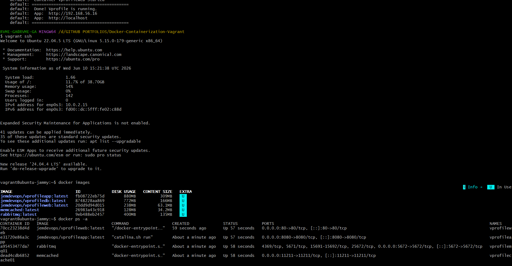
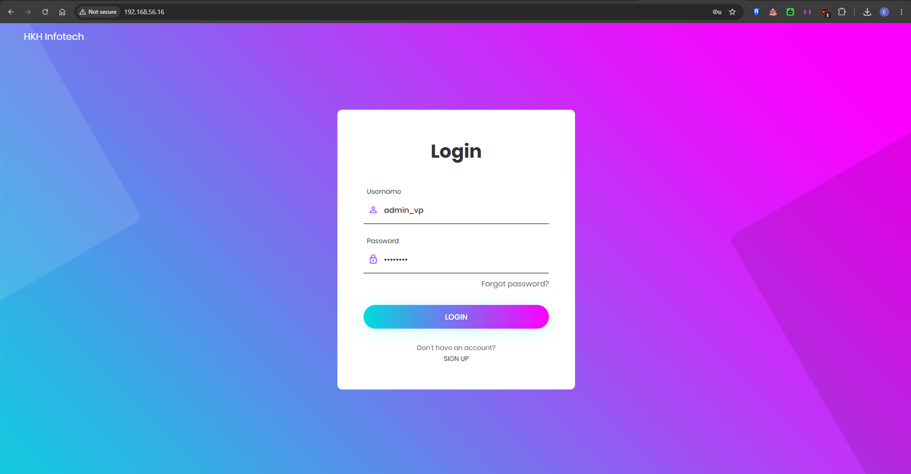
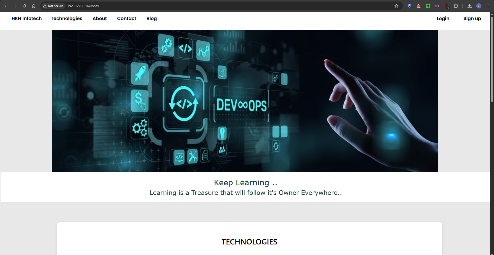
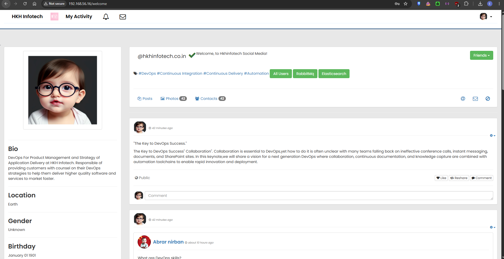
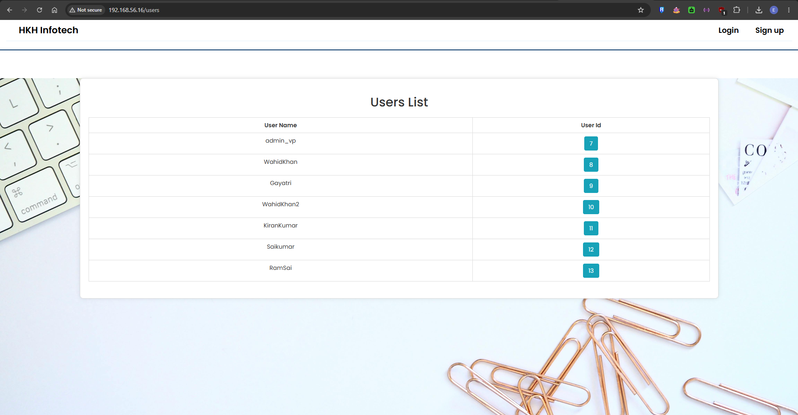
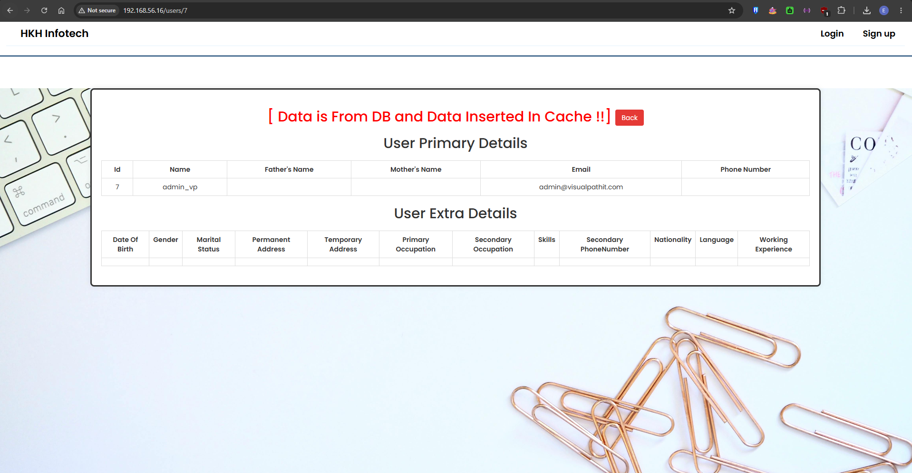
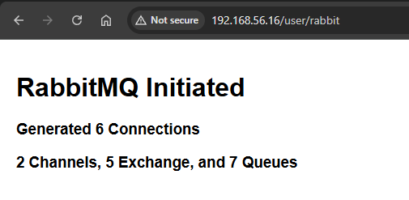

# 🐳 Vprofile — Docker Containerization with Vagrant Auto-Provisioning

A multi-tier Java web application fully containerized with Docker and auto-provisioned on a Vagrant virtual machine. Images are built and published to Docker Hub, and the entire stack spins up automatically on `vagrant up` — no manual setup required.

---

## 📌 Project Overview

This project containerizes the **Vprofile** application stack using Docker and Docker Compose, with a Vagrant-managed Ubuntu VM that automatically installs Docker and pulls all images from Docker Hub on first boot.

**Tech Stack:**

| Layer | Technology |
|-------|------------|
| Web Server | Nginx (Reverse Proxy) |
| Application | Apache Tomcat 10 + Java 21 |
| Database | MySQL 8.0 |
| Cache | Memcached |
| Message Broker | RabbitMQ |
| Containerization | Docker & Docker Compose |
| VM Provisioning | Vagrant + VirtualBox |

---

## 🏗️ Architecture

```
Browser
   │
   ▼
[vproweb]  Nginx :80          ← jemdevops/vprofileweb
   │
   ▼
[vproapp]  Tomcat :8080       ← jemdevops/vprofileapp
   │         │         │
   ▼         ▼         ▼
[vprodb]  [vprocache01]  [vpromq01]
MySQL      Memcached     RabbitMQ
:3306      :11211        :5672
```

---

## 📦 Docker Hub Images

| Image | Description |
|-------|-------------|
| [`jemdevops/vprofileapp`](https://hub.docker.com/r/jemdevops/vprofileapp) | Multi-stage Maven build → Tomcat 10 runtime |
| [`jemdevops/vprofiledb`](https://hub.docker.com/r/jemdevops/vprofiledb) | MySQL 8 pre-seeded with `accounts` schema |
| [`jemdevops/vprofileweb`](https://hub.docker.com/r/jemdevops/vprofileweb) | Nginx reverse proxy to Tomcat |

---

## 🚀 Getting Started

### Prerequisites
- [Vagrant](https://www.vagrantup.com/)
- [VirtualBox](https://www.virtualbox.org/)

### Run

```bash
# Clone the repository
git clone https://github.com/your-username/vprofile-docker.git
cd vprofile-docker

# Start and auto-provision the VM
vagrant up
```

That's it. Vagrant will:
1. Spin up an Ubuntu 22.04 VM
2. Install Docker and Docker Compose
3. Pull all images from Docker Hub
4. Run `docker compose up -d` automatically

### Access the App

| URL | Description |
|-----|-------------|
| `http://192.168.56.16` | Vprofile Web App (via Nginx) |
| `http://localhost` | Same via forwarded port |

**Default login:** `admin_vp` / `admin_vp`

---

## ⚙️ Docker Compose Services

```yaml
services:
  vprodb        # MySQL 8 — port 3306
  vprocache01   # Memcached — port 11211
  vpromq01      # RabbitMQ — port 5672
  vproapp       # Tomcat app — port 8080
  vproweb       # Nginx proxy — port 80
```

Services start in dependency order via `depends_on`:
`vprodb`, `vprocache01`, `vpromq01` → `vproapp` → `vproweb`

---

## 🖼️ Screenshots

### Auto Provisioning — Vagrant + Docker
> VM boots, Docker installs, all 5 images pulled and running automatically.



---

### Login Page
> Accessible at `http://192.168.56.16`



---

### Index / Landing Page



---

### Homepage (After Login)



---

### All Users — Data from MySQL via Tomcat



---

### Memcache Verification
> First request pulls from DB and inserts into cache. Subsequent requests serve from Memcached.



---

### RabbitMQ Verification
> Confirms RabbitMQ connections, channels, exchanges, and queues are active.



---

## 🛠️ Useful Commands

```bash
# SSH into the VM
vagrant ssh

# Check running containers
docker compose ps

# View logs
docker compose logs -f

# Restart the stack
docker compose down && docker compose up -d

# Pull latest images and restart
docker compose pull && docker compose up -d

# Stop and destroy the VM
vagrant destroy
```

---

## 🔄 Build & Push (For Development)

If you want to rebuild images from source:

```bash
# Build all images from Dockerfiles
docker compose up -d --build

# Push to Docker Hub
docker compose push
```

---

## 👤 Author

**Jem** — DevOps Portfolio Project  
Docker Hub: [hub.docker.com/u/jemdevops](https://hub.docker.com/u/jemdevops)
